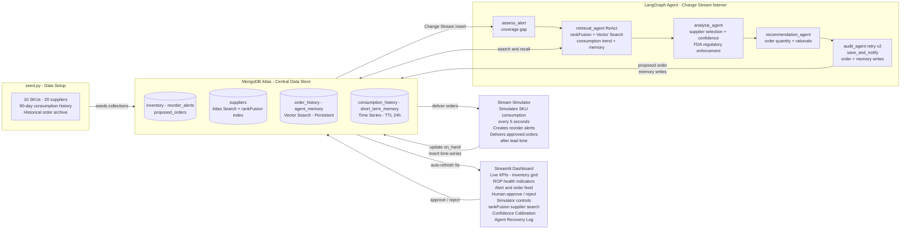

# Dashboard Architecture — Operating Model

High-level data flow across the simulator, MongoDB Atlas, LangGraph agent pipeline, and Streamlit dashboard.

For full node-by-node detail see [WORKFLOW.md](WORKFLOW.md).
