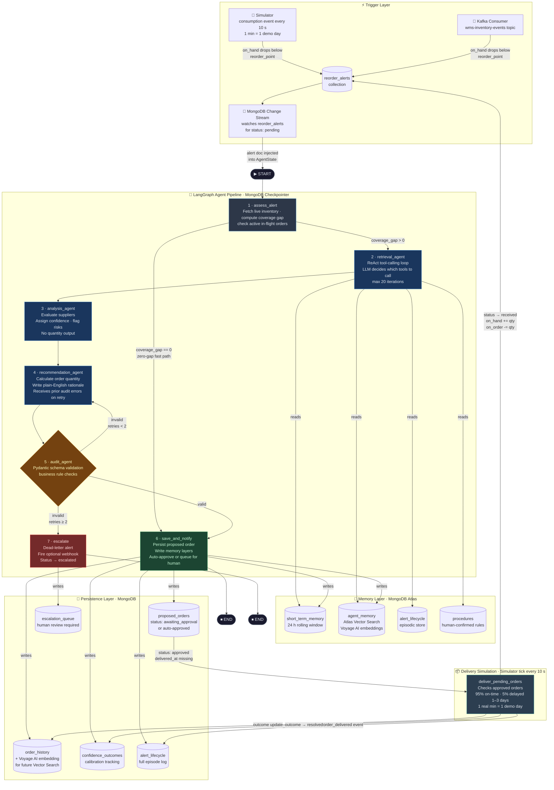
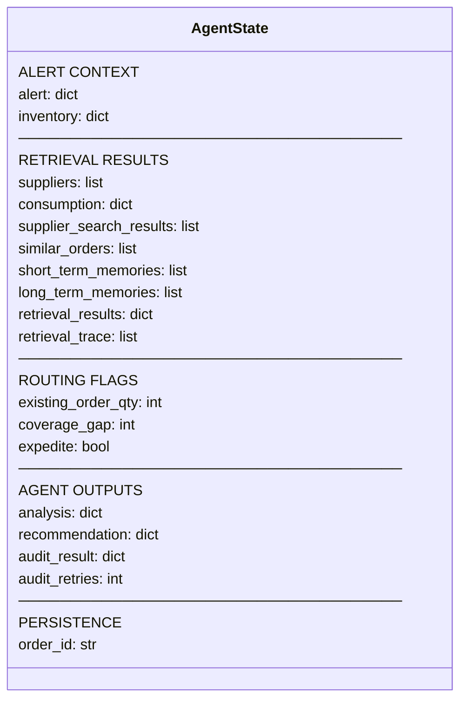

# Agent Workflow Diagrams

---

## Diagram 1 — System Workflow

End-to-end flow from inventory event to resolved order, including trigger layer, agent pipeline, memory reads/writes, and persistence.

---

## Diagram 2 — Agent Cards

Detailed view of each agent node: responsibility, LLM usage, state inputs and outputs, tools, and routing behaviour.

```mermaid
classDiagram
    direction TB

    class assess_alert {
        ROLE: Compute coverage gap · no LLM
        ─────────────────────────────────────
        LLM: none · pure DB queries
        ─────────────────────────────────────
        INPUT state fields
        alert: reorder alert doc
        ─────────────────────────────────────
        READS from MongoDB
        inventory: live on_hand · on_order
        proposed_orders: active order qty
        ─────────────────────────────────────
        OUTPUT state fields
        inventory: enriched inventory doc
        existing_order_qty: units already ordered
        coverage_gap: units still needed
        expedite: true if days_remaining < 2
        ─────────────────────────────────────
        ROUTING
        gap == 0 → save_and_notify fast path
        gap  > 0 → retrieval_agent
    }

    class retrieval_agent {
        ROLE: ReAct tool loop · gather context
        ─────────────────────────────────────
        LLM: GPT-5.4 · max 20 iterations
        ─────────────────────────────────────
        INPUT state fields
        alert · coverage_gap · expedite
        ─────────────────────────────────────
        TOOLS available
        get_inventory_position
        get_supplier_options
        get_consumption_trend
        search_suppliers_by_capability [Atlas Search]
        find_similar_past_orders [Vector Search]
        get_recent_decisions [short-term memory]
        get_learned_patterns [Vector Search]
        ─────────────────────────────────────
        OUTPUT state fields
        suppliers · consumption · similar_orders
        short_term_memories · long_term_memories
        supplier_search_results · retrieval_trace
    }

    class analysis_agent {
        ROLE: Supplier evaluation · confidence score
        ─────────────────────────────────────
        LLM: GPT-5.4 · up to 3 JSON retries
        ─────────────────────────────────────
        INPUT state fields
        suppliers · consumption
        short_term_memories · long_term_memories
        similar_orders · supplier_search_results
        ─────────────────────────────────────
        CONSTRAINT: no quantity calculation
        ─────────────────────────────────────
        OUTPUT state fields
        analysis.best_supplier_id
        analysis.best_supplier_name
        analysis.confidence: high · medium · low
        analysis.risk_flags: list of strings
        analysis.reasoning_trace
    }

    class recommendation_agent {
        ROLE: Order quantity · plain-English rationale
        ─────────────────────────────────────
        LLM: GPT-5.4 · up to 3 JSON retries
        ─────────────────────────────────────
        INPUT state fields
        analysis · coverage_gap · consumption
        suppliers · short and long-term memories
        audit_result.errors on retry
        ─────────────────────────────────────
        QUANTITY FORMULA
        gap + safety_stock - on_order
        rounded up to supplier MOQ
        ─────────────────────────────────────
        OUTPUT state fields
        recommendation.supplier_id
        recommendation.supplier_name
        recommendation.quantity
        recommendation.rationale
        recommendation.confidence
    }

    class audit_agent {
        ROLE: Schema + business rule gate
        ─────────────────────────────────────
        LLM: none · Pydantic validation
        ─────────────────────────────────────
        INPUT state fields
        recommendation · alert · coverage_gap
        ─────────────────────────────────────
        VALIDATES
        required fields present and typed
        quantity > 0
        confidence in high · medium · low
        supplier_id non-empty
        ─────────────────────────────────────
        OUTPUT state fields
        audit_result.valid: bool
        audit_result.errors: list of strings
        audit_retries: incremented on failure
        ─────────────────────────────────────
        ROUTING
        valid → save_and_notify
        invalid · retries < 2 → recommendation_agent
        invalid · retries ≥ 2 → escalate
    }

    class save_and_notify {
        ROLE: Persist order · write all memory
        ─────────────────────────────────────
        LLM: none · async DB writes
        ─────────────────────────────────────
        INPUT state fields
        alert · recommendation · analysis
        inventory · consumption · similar_orders
        ─────────────────────────────────────
        AUTO-APPROVE condition
        confidence == high AND cost < $2500
        ─────────────────────────────────────
        WRITES to MongoDB
        proposed_orders: full order document
        inventory.on_order: incremented if auto-approved
        reorder_alerts: status → processed
        alert_lifecycle: agent_decision · order_placed
        short_term_memory: rolling 24 h window
        agent_memory: vectorised rationale
        order_history: rationale + Voyage AI embedding
        confidence_outcomes: calibration record
        ─────────────────────────────────────
        OUTPUT state fields
        order_id: _id of saved proposed_order
    }

    class escalate {
        ROLE: Dead-letter · human escalation
        ─────────────────────────────────────
        LLM: none
        ─────────────────────────────────────
        INPUT state fields
        alert · recommendation · audit_result
        ─────────────────────────────────────
        TRIGGERS when
        audit_retries ≥ 2 after recommendation
        rejection_count ≥ 3 from human reviewer
        LLM circuit breaker open
        ─────────────────────────────────────
        WRITES to MongoDB
        escalation_queue: full alert context
        reorder_alerts: status → escalated
        alert_lifecycle: escalated event
        ─────────────────────────────────────
        FIRES optional webhook
        ESCALATION_WEBHOOK_URL env var
    }

    assess_alert         --> retrieval_agent      : coverage_gap > 0
    assess_alert         --> save_and_notify      : coverage_gap == 0
    retrieval_agent      --> analysis_agent
    analysis_agent       --> recommendation_agent
    recommendation_agent --> audit_agent
    audit_agent          --> save_and_notify      : valid
    audit_agent          --> recommendation_agent : retry
    audit_agent          --> escalate             : max retries
```

---

## State Schema Reference

Fields carried through `AgentState` across all nodes.

