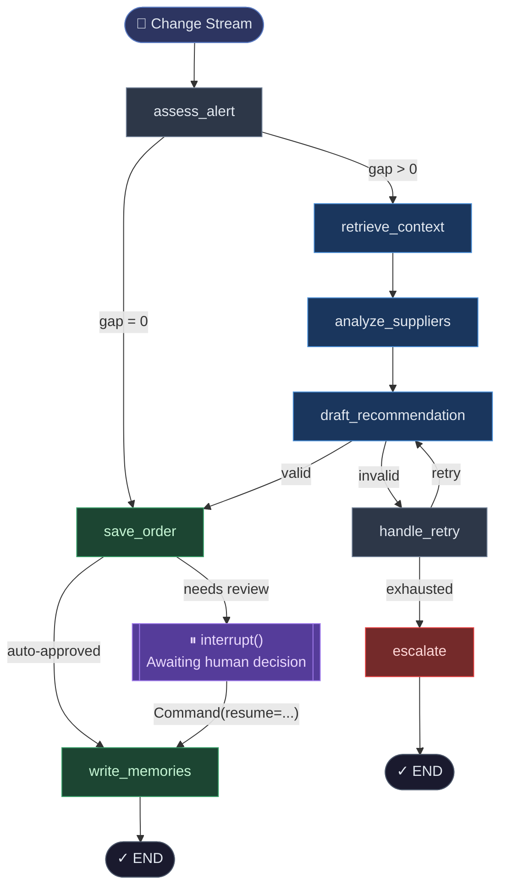
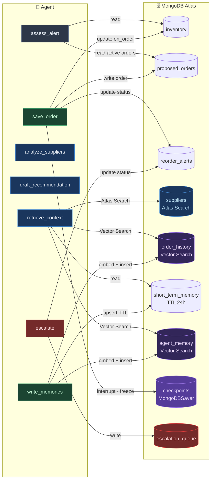

# Agent Diagrams

---

## 1 — Agent Workflow

```mermaid
flowchart TD
    CS(["📡 Change Stream"])
    A1["assess_alert"]
    A2a["retrieve_context"]
    A2b["analyze_suppliers"]
    A2c["draft_recommendation"]
    A2d["handle_retry"]
    A3["save_order"]
    A4["write_memories"]
    A5["escalate"]
    PAUSE[["⏸ interrupt()\nAwaiting human decision"]]
    END1(["✓ END"])
    END2(["✓ END"])

    CS --> A1
    A1 -->|"gap = 0"| A3
    A1 -->|"gap > 0"| A2a
    A2a --> A2b
    A2b --> A2c
    A2c -->|"valid"| A3
    A2c -->|"invalid"| A2d
    A2d -->|"retry"| A2c
    A2d -->|"exhausted"| A5
    A3 -->|"auto-approved"| A4
    A3 -->|"needs review"| PAUSE
    PAUSE -->|"Command(resume=...)"| A4
    A4 --> END1
    A5 --> END2

    style CS    fill:#2d3561,color:#e2e8f0,stroke:#5a7bc2
    style A1   fill:#2d3748,color:#e2e8f0,stroke:#718096
    style A2a  fill:#1a365d,color:#e2e8f0,stroke:#4a90d9
    style A2b  fill:#1a365d,color:#e2e8f0,stroke:#4a90d9
    style A2c  fill:#1a365d,color:#e2e8f0,stroke:#4a90d9
    style A2d  fill:#2d3748,color:#e2e8f0,stroke:#718096
    style A3   fill:#1c4532,color:#c6f6d5,stroke:#38a169
    style A4   fill:#1c4532,color:#c6f6d5,stroke:#38a169
    style A5   fill:#742a2a,color:#fed7d7,stroke:#e53e3e
    style PAUSE fill:#553c9a,color:#e9d8fd,stroke:#9f7aea
    style END1  fill:#1a1a2e,color:#e2e8f0,stroke:#4a5568
    style END2  fill:#1a1a2e,color:#e2e8f0,stroke:#4a5568
```

---

## 2 — Agent ↔ MongoDB Interactions

```mermaid
flowchart LR
    subgraph AGENT["🤖 Agent"]
        A1["assess_alert"]
        A2a["retrieve_context"]
        A2b["analyze_suppliers"]
        A2c["draft_recommendation"]
        A3["save_order"]
        A4["write_memories"]
        A5["escalate"]
    end

    subgraph DB["🗄️ MongoDB Atlas"]
        INV[("inventory")]
        PO[("proposed_orders")]
        RA[("reorder_alerts")]
        SUP[("suppliers\nAtlas Search")]
        OH[("order_history\nVector Search")]
        STM[("short_term_memory\nTTL 24h")]
        LTM[("agent_memory\nVector Search")]
        CK[("checkpoints\nMongoDBSaver")]
        EQ[("escalation_queue")]
    end

    A1 -->|"read"| INV
    A1 -->|"read active orders"| PO

    A2a -->|"Atlas Search"| SUP
    A2a -->|"Vector Search"| OH
    A2a -->|"Vector Search"| LTM
    A2a -->|"read"| STM

    A3 -->|"write order"| PO
    A3 -->|"update status"| RA
    A3 -->|"update on_order"| INV
    A3 -->|"interrupt · freeze"| CK

    A4 -->|"upsert TTL"| STM
    A4 -->|"embed + insert"| LTM
    A4 -->|"embed + insert"| OH

    A5 -->|"write"| EQ
    A5 -->|"update status"| RA

    style A1   fill:#2d3748,color:#e2e8f0,stroke:#718096
    style A2a  fill:#1a365d,color:#e2e8f0,stroke:#4a90d9
    style A2b  fill:#1a365d,color:#e2e8f0,stroke:#4a90d9
    style A2c  fill:#1a365d,color:#e2e8f0,stroke:#4a90d9
    style A3   fill:#1c4532,color:#c6f6d5,stroke:#38a169
    style A4   fill:#1c4532,color:#c6f6d5,stroke:#38a169
    style A5   fill:#742a2a,color:#fed7d7,stroke:#e53e3e
    style SUP fill:#1a365d,color:#bee3f8,stroke:#4a90d9
    style OH  fill:#322659,color:#e9d8fd,stroke:#9f7aea
    style LTM fill:#322659,color:#e9d8fd,stroke:#9f7aea
    style CK  fill:#553c9a,color:#e9d8fd,stroke:#9f7aea
    style EQ  fill:#742a2a,color:#fed7d7,stroke:#e53e3e
```
